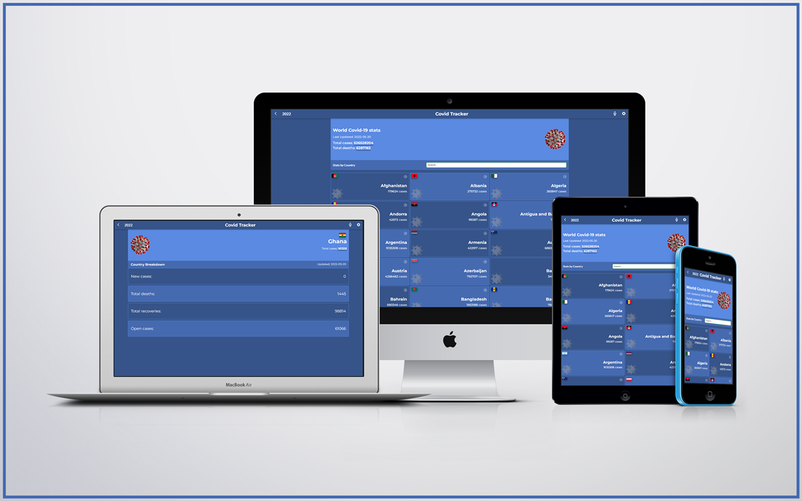

# Covid-19 Tracking App

> A Single Page Application that allows users to track the novel coronavirus, SARS-CoV-2 across the globe. Covid-19 data can be filtered to the country level.

## Screenshot

 

## Built With

- ReactJS
- Redux
- CSS/SCSS
- ~~[Narrativa API](https://covid19tracking.narrativa.com/index_en.html)~~
- [disease.sh](https://disease.sh/)

## Live site 🚀

🔗 [Heroku](https://mv-covid-stats.herokuapp.com/)

🔗 [Netlify](https://covid-dewslyse.netlify.app/)

## Getting Started

### Setup

To get a local copy up and running follow this simple step:

- Clone repository to your local machine: 

`git@github.com:dewslyse/mv-covid-stats.git`

This will create a directory in the name of the project folder.

### Install

- `cd mv-covid-stats`
- Run `npm install` to install dependencies

### Usage

- Run `npm start` to start app
You should see the app in your browser address bar at `http://localhost:3000`

### Run tests
- Run `npm test` to launch the test runner in an interactive watch mode.
See the section about [running tests](https://facebook.github.io/create-react-app/docs/running-tests) for more information.

## Author

👤 **@dewslyse**

- GitHub: [@dewslyse](https://github.com/dewslyse)

## 🤝 Contributing

Contributions, issues, and feature requests are welcome!

Feel free to check the [issues page](../../issues/).

## Show your support

Give a ⭐️ if you like this project!

## Acknowledgments

- Covid-19 Data provided by [disease.sh](https://disease.sh/)

- Original design idea by [Nelson Sakwa on Behance](https://www.behance.net/sakwadesignstudio).

## 📝 License

This project is [MIT](./LICENSE) licensed.
